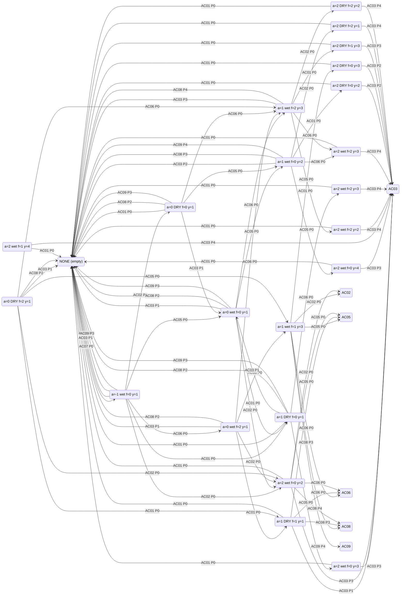

# tile_dp — Daily State-Action Graphs (single_tile_daily_state_action)

Per-tile **daily** state-action graphs. State = the tile at day start
(hour 0); edge = one daily action chain executed by the workers, then
idle to the next day start.

## Status

| entity | kind | lifecycle | states | edges | graph npz |
|---|---|---|---|---|---|
| CARROT | one-shot crop | 6 days | 22 | 90 | `graph_CARROT_lifecycle.npz` |
| WHEAT | one-shot crop | 7 days | 34 | 158 | `graph_WHEAT_lifecycle.npz` |
| TOMATO | ongoing crop | 14 days | 99 | 567 | `graph_TOMATO_lifecycle.npz` |
| STRAWBERRY | ongoing crop | 19 days | 159 | 999 | `graph_STRAWBERRY_lifecycle.npz` |
| MELON | one-shot crop | 15 days | 89 | 368 | `graph_MELON_lifecycle.npz` |
| GOOSE / COW / SHEEP | animals | — | deferred | — | next step |

## Carrot states (22, sorted)

| ID | age | consec | fert_left | yield | note |
|----|-----|--------|-----------|-------|------|
| SC01 | — | — | — | — | NONE: empty tile, ready for planting |
| SC02 | -1 | 0 | 0 | 1 | day after planting; outside the golden window |
| SC03 | 0 | 0 | 0 | 1 | FIRST HARVEST DAY; golden window gives +2 |
| SC04 | 0 | 0 | 2 | 1 | FIRST HARVEST DAY, fert-covered |
| SC05 | 0 | 1 | 0 | 1 | FIRST HARVEST DAY, DRY yesterday |
| SC06 | 0 | 1 | 2 | 1 | FIRST HARVEST DAY, DRY + fert-covered |
| SC07 | 1 | 0 | 0 | 2 | last golden-window day, watered yesterday |
| SC08 | 1 | 0 | 1 | 3 | last window day, 1 fert day left |
| SC09 | 1 | 0 | 2 | 3 | last window day, 2 fert days left |
| SC10 | 1 | 1 | 0 | 1 | last window day, DRY yesterday |
| SC11 | 1 | 1 | 1 | 1 | last window day, DRY + 1 fert day |
| SC12 | 2 | 0 | 0 | 2 | final living day — harvest or lose |
| SC13 | 2 | 0 | 0 | 3 | final day, 3 units |
| SC14 | 2 | 0 | 0 | 4 | final day, 4 units |
| SC15 | 2 | 0 | 1 | 4 | final day, 4 units, 1 fert day left |
| SC16 | 2 | 0 | 2 | 2 | final day, 2 units, 2 fert days |
| SC17 | 2 | 0 | 2 | 3 | final day, 3 units, 2 fert days |
| SC18 | 2 | 0 | 2 | 3 | final day variant |
| SC19 | 2 | 1 | 0 | 2 | final day, DRY yesterday |
| SC20 | 2 | 1 | 0 | 3 | final day, DRY + 3 units |
| SC21 | 2 | 1 | 1 | 3 | final day, DRY + 1 fert + 3 units |
| SC22 | 2 | 1 | 2 | 1 | final day, DRY + 2 fert + 1 unit |

Plus NONE (SC01) as the entry state; WEED states exist for the dig
path.

## Carrot chains (canonical order)

Chains = canonical subsets of the state's ops. Ordering (Hossein):
PLANT → FERTILIZE → WATER → HARVEST. WATER strictly before HARVEST for
one-shot crops (the watered unit lands immediately, F026).

## Action chains (sorted, ID → ops)

| ID | Chain |
|----|-------|
| AC01 | PASS |
| AC02 | FERTILIZE |
| AC03 | HARVEST |
| AC05 | WATER |
| AC06 | FERTILIZE → WATER |
| AC07 | PLANT → WATER (planting, from NONE) |
| AC08 | WATER → HARVEST |
| AC09 | FERTILIZE → WATER → HARVEST |

## Edge list (state — chain → state, production, resources)

| From | Chain | To | Production | Resources |
|------|-------|----|-----------|-----------|
| SC01 | AC01 | SC01 | 0 | LABOR: 1 |
| SC01 | AC07 | SC02 | 0 | LABOR: 2, SEED: 1 |
| SC02 | AC01 | SC05 | 0 | — |
| SC02 | AC02 | SC06 | 0 | LABOR: 1, FERT: 1 |
| SC02 | AC05 | SC03 | 0 | LABOR: 1 |
| SC02 | AC06 | SC04 | 0 | LABOR: 2, FERT: 1 |
| SC03 | AC01 | SC10 | 0 | — |
| SC03 | AC02 | SC12 | 0 | LABOR: 1, FERT: 1 |
| SC03 | AC03 | SC01 | 1 | LABOR: 1 |
| SC03 | AC05 | SC07 | 0 | LABOR: 1 |
| SC03 | AC06 | SC09 | 0 | LABOR: 2, FERT: 1 |
| SC03 | AC08 | SC01 | 2 | LABOR: 2 |
| SC03 | AC09 | SC01 | 3 | LABOR: 3, FERT: 1 |
| SC04 | AC01 | SC11 | 0 | — |
| SC04 | AC02 | SC12 | 0 | LABOR: 1, FERT: 1 |
| SC04 | AC03 | SC01 | 1 | LABOR: 1 |
| SC04 | AC05 | SC08 | 0 | LABOR: 1 |
| SC04 | AC06 | SC09 | 0 | LABOR: 2, FERT: 1 |
| SC04 | AC08 | SC01 | 3 | LABOR: 2 |
| SC05 | AC01 | SC01 | 0 | — |
| SC05 | AC03 | SC01 | 1 | LABOR: 1 |
| SC05 | AC05 | SC07 | 0 | LABOR: 1 |
| SC05 | AC06 | SC09 | 0 | LABOR: 2, FERT: 1 |
| SC05 | AC08 | SC01 | 2 | LABOR: 2 |
| SC05 | AC09 | SC01 | 3 | LABOR: 3, FERT: 1 |
| SC06 | AC01 | SC11 | 0 | — |
| SC06 | AC02 | SC12 | 0 | LABOR: 1, FERT: 1 |
| SC06 | AC03 | SC01 | 1 | LABOR: 1 |
| SC06 | AC05 | SC08 | 0 | LABOR: 1 |
| SC06 | AC06 | SC09 | 0 | LABOR: 2, FERT: 1 |
| SC06 | AC08 | SC01 | 3 | LABOR: 2 |
| SC07 | AC01 | SC19 | 0 | — |
| SC07 | AC02 | SC22 | 0 | LABOR: 1, FERT: 1 |
| SC07 | AC03 | SC01 | 2 | LABOR: 1 |
| SC07 | AC05 | SC14 | 0 | LABOR: 1 |
| SC07 | AC06 | SC18 | 0 | LABOR: 2, FERT: 1 |
| SC07 | AC08 | SC01 | 3 | LABOR: 2 |
| SC07 | AC09 | SC01 | 4 | LABOR: 3, FERT: 1 |
| SC08 | AC01 | SC20 | 0 | — |
| SC08 | AC02 | SC23 | 0 | LABOR: 1, FERT: 1 |
| SC08 | AC03 | SC01 | 3 | LABOR: 1 |
| SC08 | AC05 | SC15 | 0 | LABOR: 1 |
| SC08 | AC06 | SC18 | 0 | LABOR: 2, FERT: 1 |
| SC08 | AC08 | SC01 | 4 | LABOR: 2 |
| SC09 | AC01 | SC21 | 0 | — |
| SC09 | AC02 | SC23 | 0 | LABOR: 1, FERT: 1 |
| SC09 | AC03 | SC01 | 3 | LABOR: 1 |
| SC09 | AC05 | SC16 | 0 | LABOR: 1 |
| SC09 | AC06 | SC18 | 0 | LABOR: 2, FERT: 1 |
| SC09 | AC08 | SC01 | 4 | LABOR: 2 |
| SC10 | AC01 | SC01 | 0 | — |
| SC10 | AC03 | SC01 | 1 | LABOR: 1 |
| SC10 | AC05 | SC13 | 0 | LABOR: 1 |
| SC10 | AC06 | SC17 | 0 | LABOR: 2, FERT: 1 |
| SC10 | AC08 | SC01 | 2 | LABOR: 2 |
| SC10 | AC09 | SC01 | 3 | LABOR: 3, FERT: 1 |
| SC11 | AC01 | SC01 | 0 | — |
| SC11 | AC03 | SC01 | 1 | LABOR: 1 |
| SC11 | AC05 | SC14 | 0 | LABOR: 1 |
| SC11 | AC06 | SC17 | 0 | LABOR: 2, FERT: 1 |
| SC11 | AC08 | SC01 | 3 | LABOR: 2 |
| SC12 | AC01 | SC01 | 0 | — |
| SC12 | AC02 | SC23 | 0 | LABOR: 1, FERT: 1 |
| SC12 | AC03 | SC01 | 3 | LABOR: 1 |
| SC12 | AC05 | SC16 | 0 | LABOR: 1 |
| SC12 | AC06 | SC18 | 0 | LABOR: 2, FERT: 1 |
| SC12 | AC08 | SC01 | 4 | LABOR: 2 |
| SC13 | AC01 | SC01 | 0 | — |
| SC13 | AC03 | SC01 | 3 | LABOR: 1 |
| SC14 | AC01 | SC01 | 0 | — |
| SC14 | AC03 | SC01 | 3 | LABOR: 1 |
| SC15 | AC01 | SC01 | 0 | — |
| SC15 | AC03 | SC01 | 4 | LABOR: 1 |
| SC16 | AC01 | SC01 | 0 | — |
| SC16 | AC03 | SC01 | 4 | LABOR: 1 |
| SC17 | AC01 | SC01 | 0 | — |
| SC17 | AC03 | SC01 | 4 | LABOR: 1 |
| SC18 | AC01 | SC01 | 0 | — |
| SC18 | AC03 | SC01 | 4 | LABOR: 1 |
| SC19 | AC01 | SC01 | 0 | — |
| SC19 | AC03 | SC01 | 2 | LABOR: 1 |
| SC20 | AC01 | SC01 | 0 | — |
| SC20 | AC03 | SC01 | 2 | LABOR: 1 |
| SC21 | AC01 | SC01 | 0 | — |
| SC21 | AC03 | SC01 | 3 | LABOR: 1 |
| SC22 | AC01 | SC01 | 0 | — |
| SC22 | AC03 | SC01 | 4 | LABOR: 1 |
| SC23 | AC01 | SC01 | 0 | — |
| SC23 | AC03 | SC01 | 4 | LABOR: 1 |

## Diagram

## Edge list (state — chain → state, production, resources)

| From | Chain | To | Production | Resources |
|------|-------|----|-----------|-----------|
| SC01 | AC01 | SC01 | 0 | LABOR: 1 |
| SC01 | AC07 | SC02 | 0 | LABOR: 2, SEED: 1 |
| SC02 | AC01 | SC05 | 0 | — |
| SC02 | AC02 | SC06 | 0 | LABOR: 1, FERT: 1 |
| SC02 | AC05 | SC03 | 0 | LABOR: 1 |
| SC02 | AC06 | SC04 | 0 | LABOR: 2, FERT: 1 |
| SC03 | AC01 | SC10 | 0 | — |
| SC03 | AC02 | SC12 | 0 | LABOR: 1, FERT: 1 |
| SC03 | AC03 | SC01 | 1 | LABOR: 1 |
| SC03 | AC05 | SC07 | 0 | LABOR: 1 |
| SC03 | AC06 | SC09 | 0 | LABOR: 2, FERT: 1 |
| SC03 | AC08 | SC01 | 2 | LABOR: 2 |
| SC03 | AC09 | SC01 | 3 | LABOR: 3, FERT: 1 |
| SC04 | AC01 | SC11 | 0 | — |
| SC04 | AC02 | SC12 | 0 | LABOR: 1, FERT: 1 |
| SC04 | AC03 | SC01 | 1 | LABOR: 1 |
| SC04 | AC05 | SC08 | 0 | LABOR: 1 |
| SC04 | AC06 | SC09 | 0 | LABOR: 2, FERT: 1 |
| SC04 | AC08 | SC01 | 3 | LABOR: 2 |
| SC05 | AC01 | SC01 | 0 | — |
| SC05 | AC03 | SC01 | 1 | LABOR: 1 |
| SC05 | AC06 | SC09 | 0 | LABOR: 2, FERT: 1 |
| SC05 | AC08 | SC01 | 2 | LABOR: 2 |
| SC05 | AC09 | SC01 | 3 | LABOR: 3, FERT: 1 |
| SC06 | AC01 | SC11 | 0 | — |
| SC06 | AC02 | SC12 | 0 | LABOR: 1, FERT: 1 |
| SC06 | AC03 | SC01 | 1 | LABOR: 1 |
| SC06 | AC05 | SC08 | 0 | LABOR: 1 |
| SC06 | AC06 | SC09 | 0 | LABOR: 2, FERT: 1 |
| SC06 | AC08 | SC01 | 3 | LABOR: 2 |
| SC07 | AC01 | SC19 | 0 | — |
| SC07 | AC02 | SC22 | 0 | LABOR: 1, FERT: 1 |
| SC07 | AC03 | SC01 | 2 | LABOR: 1 |
| SC07 | AC05 | SC14 | 0 | LABOR: 1 |
| SC07 | AC06 | SC18 | 0 | LABOR: 2, FERT: 1 |
| SC07 | AC08 | SC01 | 3 | LABOR: 2 |
| SC07 | AC09 | SC01 | 4 | LABOR: 3, FERT: 1 |
| SC08 | AC01 | SC20 | 0 | — |
| SC08 | AC02 | SC23 | 0 | LABOR: 1, FERT: 1 |
| SC08 | AC03 | SC01 | 3 | LABOR: 1 |
| SC08 | AC05 | SC15 | 0 | LABOR: 1 |
| SC08 | AC06 | SC18 | 0 | LABOR: 2, FERT: 1 |
| SC08 | AC08 | SC01 | 4 | LABOR: 2 |
| SC09 | AC01 | SC21 | 0 | — |
| SC09 | AC02 | SC23 | 0 | LABOR: 1, FERT: 1 |
| SC09 | AC03 | SC01 | 3 | LABOR: 1 |
| SC09 | AC05 | SC16 | 0 | LABOR: 1 |
| SC09 | AC06 | SC18 | 0 | LABOR: 2, FERT: 1 |
| SC09 | AC08 | SC01 | 4 | LABOR: 2 |
