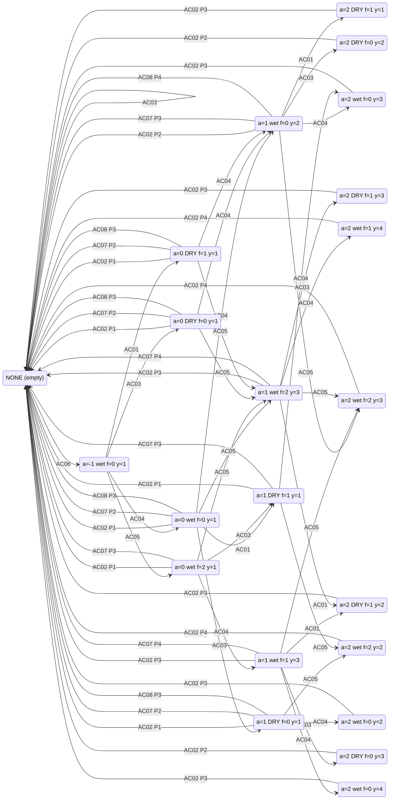

# Carrot Tile — Daily State-Action Graph

Branch: `single_tile_daily_state_action` · Engine-verified (built via
FastSim, R003). **State** = the tile at DAY START (hour 0). **Edge** =
one daily action chain (canonical order PLANT → FERTILIZE → WATER →
HARVEST) executed by the workers, then idle until the next day start.
Weed-spawn RNG ignored (v1).

## States (sorted)

Total: **22** day-start states.

| ID | age | consec (yesterday) | fert_left | yield | note |
|----|-----|--------------------|-----------|-------|------|
| SC01 | — | — | — | — | NONE: empty tile, ready for planting |
| SC02 | -1 | watered yesterday | 0 | 1 | day after planting; outside the golden window |
| SC03 | 0 | watered yesterday | 0 | 1 | FIRST HARVEST DAY; golden window (water/fert give +2) |
| SC04 | 0 | watered yesterday | 2 | 1 | FIRST HARVEST DAY; golden window (water/fert give +2) |
| SC05 | 0 | DRY yesterday | 0 | 1 | FIRST HARVEST DAY; golden window (water/fert give +2) |
| SC06 | 0 | DRY yesterday | 1 | 1 | FIRST HARVEST DAY; golden window (water/fert give +2) |
| SC07 | 1 | watered yesterday | 0 | 2 | last golden-window day |
| SC08 | 1 | watered yesterday | 1 | 3 | last golden-window day |
| SC09 | 1 | watered yesterday | 2 | 3 | last golden-window day |
| SC10 | 1 | DRY yesterday | 0 | 1 | last golden-window day |
| SC11 | 1 | DRY yesterday | 1 | 1 | last golden-window day |
| SC12 | 2 | watered yesterday | 0 | 2 | final living day — harvest or lose the tile |
| SC13 | 2 | watered yesterday | 0 | 3 | final living day — harvest or lose the tile |
| SC14 | 2 | watered yesterday | 0 | 4 | final living day — harvest or lose the tile |
| SC15 | 2 | watered yesterday | 1 | 4 | final living day — harvest or lose the tile |
| SC16 | 2 | watered yesterday | 2 | 2 | final living day — harvest or lose the tile |
| SC17 | 2 | watered yesterday | 2 | 3 | final living day — harvest or lose the tile |
| SC18 | 2 | DRY yesterday | 0 | 2 | final living day — harvest or lose the tile |
| SC19 | 2 | DRY yesterday | 0 | 3 | final living day — harvest or lose the tile |
| SC20 | 2 | DRY yesterday | 1 | 1 | final living day — harvest or lose the tile |
| SC21 | 2 | DRY yesterday | 1 | 2 | final living day — harvest or lose the tile |
| SC22 | 2 | DRY yesterday | 1 | 3 | final living day — harvest or lose the tile |

(WEED is unreachable as a day-start state: dry-night deaths decode
to NONE — the tile is empty the next morning. Weed-spawn RNG is
ignored in v1.)

## Action chains (sorted)

| ID | Chain | Labor | Resources |
|----|-------|-------|-----------|
| AC01 | FERTILIZE | 2 h | 1 FERTILIZER (market) |
| AC02 | HARVEST | 1 h | — |
| AC03 | PASS | 0 h | — |
| AC04 | WATER | 1 h | — |
| AC05 | FERTILIZE -> WATER | 3 h | 1 FERTILIZER (market) |
| AC06 | PLANT -> WATER | 2 h | 1 SEED (market) |
| AC07 | WATER -> HARVEST | 2 h | — |
| AC08 | FERTILIZE -> WATER -> HARVEST | 4 h | 1 FERTILIZER (market) |

Note: market purchases land one turn BEFORE the unit op that needs
them (F030) — the BUY turn costs no labor. FERTILIZE costs 2 labor
hours (PICKUP + FERTILIZE).

## Edge list

| From | Chain | To | Production | Resources |
|------|-------|----|-----------|-----------|
| SC01 | AC03 | SC01 | 0 | LABOR: 1 |
| SC01 | AC06 | SC02 | 0 | LABOR: 2, SEED: 1 |
| SC02 | AC01 | SC06 | 0 | LABOR: 1, FERT: 1 |
| SC02 | AC03 | SC05 | 0 | LABOR: 1 |
| SC02 | AC04 | SC03 | 0 | LABOR: 1 |
| SC02 | AC05 | SC04 | 0 | LABOR: 2, FERT: 1 |
| SC03 | AC01 | SC11 | 0 | LABOR: 1, FERT: 1 |
| SC03 | AC02 | SC01 | 1 carrot | LABOR: 1 |
| SC03 | AC03 | SC10 | 0 | LABOR: 1 |
| SC03 | AC04 | SC07 | 0 | LABOR: 1 |
| SC03 | AC05 | SC09 | 0 | LABOR: 2, FERT: 1 |
| SC03 | AC07 | SC01 | 2 carrot | LABOR: 2 |
| SC03 | AC08 | SC01 | 3 carrot | LABOR: 3, FERT: 1 |
| SC04 | AC02 | SC01 | 1 carrot | LABOR: 1 |
| SC04 | AC03 | SC11 | 0 | LABOR: 1 |
| SC04 | AC04 | SC08 | 0 | LABOR: 1 |
| SC04 | AC05 | SC09 | 0 | LABOR: 2, FERT: 1 |
| SC04 | AC07 | SC01 | 3 carrot | LABOR: 2 |
| SC05 | AC02 | SC01 | 1 carrot | LABOR: 1 |
| SC05 | AC04 | SC07 | 0 | LABOR: 1 |
| SC05 | AC05 | SC09 | 0 | LABOR: 2, FERT: 1 |
| SC05 | AC07 | SC01 | 2 carrot | LABOR: 2 |
| SC05 | AC08 | SC01 | 3 carrot | LABOR: 3, FERT: 1 |
| SC06 | AC02 | SC01 | 1 carrot | LABOR: 1 |
| SC06 | AC04 | SC07 | 0 | LABOR: 1 |
| SC06 | AC05 | SC09 | 0 | LABOR: 2, FERT: 1 |
| SC06 | AC07 | SC01 | 2 carrot | LABOR: 2 |
| SC06 | AC08 | SC01 | 3 carrot | LABOR: 3, FERT: 1 |
| SC07 | AC01 | SC20 | 0 | LABOR: 1, FERT: 1 |
| SC07 | AC02 | SC01 | 2 carrot | LABOR: 1 |
| SC07 | AC03 | SC18 | 0 | LABOR: 1 |
| SC07 | AC04 | SC13 | 0 | LABOR: 1 |
| SC07 | AC05 | SC17 | 0 | LABOR: 2, FERT: 1 |
| SC07 | AC07 | SC01 | 3 carrot | LABOR: 2 |
| SC07 | AC08 | SC01 | 4 carrot | LABOR: 3, FERT: 1 |
| SC08 | AC01 | SC21 | 0 | LABOR: 1, FERT: 1 |
| SC08 | AC02 | SC01 | 3 carrot | LABOR: 1 |
| SC08 | AC03 | SC19 | 0 | LABOR: 1 |
| SC08 | AC04 | SC14 | 0 | LABOR: 1 |
| SC08 | AC05 | SC17 | 0 | LABOR: 2, FERT: 1 |
| SC08 | AC07 | SC01 | 4 carrot | LABOR: 2 |
| SC09 | AC01 | SC21 | 0 | LABOR: 1, FERT: 1 |
| SC09 | AC02 | SC01 | 3 carrot | LABOR: 1 |
| SC09 | AC03 | SC22 | 0 | LABOR: 1 |
| SC09 | AC04 | SC15 | 0 | LABOR: 1 |
| SC09 | AC05 | SC17 | 0 | LABOR: 2, FERT: 1 |
| SC09 | AC07 | SC01 | 4 carrot | LABOR: 2 |
| SC10 | AC02 | SC01 | 1 carrot | LABOR: 1 |
| SC10 | AC04 | SC12 | 0 | LABOR: 1 |
| SC10 | AC05 | SC16 | 0 | LABOR: 2, FERT: 1 |
| SC10 | AC07 | SC01 | 2 carrot | LABOR: 2 |
| SC10 | AC08 | SC01 | 3 carrot | LABOR: 3, FERT: 1 |
| SC11 | AC02 | SC01 | 1 carrot | LABOR: 1 |
| SC11 | AC04 | SC13 | 0 | LABOR: 1 |
| SC11 | AC05 | SC16 | 0 | LABOR: 2, FERT: 1 |
| SC11 | AC07 | SC01 | 3 carrot | LABOR: 2 |
| SC12 | AC02 | SC01 | 3 carrot | LABOR: 1 |
| SC13 | AC02 | SC01 | 3 carrot | LABOR: 1 |
| SC14 | AC02 | SC01 | 3 carrot | LABOR: 1 |
| SC15 | AC02 | SC01 | 4 carrot | LABOR: 1 |
| SC16 | AC02 | SC01 | 4 carrot | LABOR: 1 |
| SC17 | AC02 | SC01 | 4 carrot | LABOR: 1 |
| SC18 | AC02 | SC01 | 2 carrot | LABOR: 1 |
| SC19 | AC02 | SC01 | 2 carrot | LABOR: 1 |
| SC20 | AC02 | SC01 | 3 carrot | LABOR: 1 |
| SC21 | AC02 | SC01 | 3 carrot | LABOR: 1 |
| SC22 | AC02 | SC01 | 3 carrot | LABOR: 1 |

## Diagram

